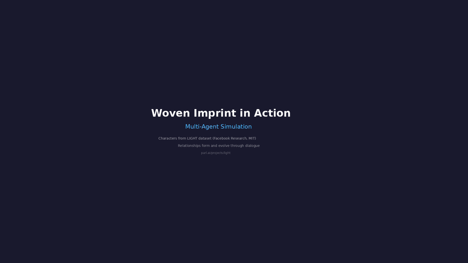

# Woven Imprint

[](https://github.com/virtaava/woven-imprint/actions/workflows/ci.yml)
[](https://www.python.org/downloads/)
[](LICENSE)

**Persistent Character Infrastructure**

Characters that survive across time.

**Setup**: [Windows/WSL](docs/setup-windows.md) | [macOS](docs/setup-mac.md) | [Linux](docs/setup-linux.md) | [Docker](docs/setup-docker.md) | [Developer Guide](docs/DEVELOPER_GUIDE.md) | [Configuration](docs/CONFIGURATION.md) | [Architecture](docs/ARCHITECTURE.md) | [Evaluation](docs/EVALUATION.md) | [MCP Setup](examples/mcp_setup.md)

Woven Imprint is infrastructure for building AI characters that persist. Characters
accumulate memories across sessions, maintain consistent personalities, and develop
relationships that evolve over weeks and months of interaction.

Your NPC remembers the player who helped them three weeks ago. Your companion recalls
a conversation from last summer. Your training partner adapts to the learner's
progress over hundreds of sessions.

Every interaction leaves an imprint. Every memory is woven into who the character becomes.

## The Problem

Most AI characters reset every session. They forget who you are, what you told them,
and what happened between you. The few systems that try to persist memory do it poorly —
stuffing facts into a prompt window until it overflows.

Games, companions, simulations, and interactive fiction all need characters that:
- **Remember** the player weeks later — not just the last 5 minutes
- **Stay consistent** — same personality, same backstory, same voice
- **Develop relationships** — trust builds slowly, betrayal has consequences
- **Grow** — opinions shift, habits form, characters change through experience

No existing tool does all of this. Woven Imprint does.

## Installation

```bash
pip install woven-imprint
```

Requires Python 3.11+ and an LLM backend ([Ollama](https://ollama.com), OpenAI, or Anthropic).
Configure your provider in `~/.woven_imprint/config.yaml` or via env vars — see [Configuration](docs/CONFIGURATION.md).
See [Getting Started](docs/GETTING_STARTED.md) for platform-specific setup.

**Prefer a graphical interface?**

```bash
pip install woven-imprint[demo]
woven-imprint demo
```

Opens a browser with chat, character management, migration, and settings — no terminal needed.

## Quick Start

```python
from woven_imprint import Engine

engine = Engine("characters.db")

# Create a character with persistent identity
alice = engine.create_character(
    name="Alice",
    birthdate="1998-03-15",  # age derived automatically, increments on birthday
    persona={
        "backstory": "A sharp-witted detective who left the force after her partner's death.",
        "personality": "witty, skeptical, secretly lonely",
        "speaking_style": "clipped sentences, dark humor, avoids emotional topics",
        "occupation": "private investigator",
    },
)

# Conversation — memories persist automatically
response = alice.chat("Hey Alice, how's the case going?")

# End session — generates summary, stores to long-term memory
alice.end_session()

# Days later... she remembers
response = alice.chat("Remember the harbor case we discussed?")

# Character reflects on accumulated experiences
alice.reflect()

# Relationship tracking — trust, affection, respect evolve per interaction
print(alice.relationships.describe("player_1"))

# Export full character state — portable, self-contained
alice.export("alice_v1.json")
```

## Architecture

### Three-Tier Memory
- **Buffer** — raw observations from recent interactions
- **Core** — consolidated memories, session summaries, reflections
- **Bedrock** — fundamental identity, defining moments, core beliefs

### Multi-Strategy Retrieval
Reciprocal Rank Fusion across five rankers: semantic similarity, BM25 keyword match,
recency decay, importance scoring, and relationship context boost.

### Persona Enforcement
Four constraint levels: hard (immutable identity), temporal (age from birthdate,
location changes), soft (personality traits that evolve), emergent (formed through interaction).

### Relationship Model
Five emotional dimensions (trust, affection, respect, familiarity, tension) with
bounded change per interaction, trajectory detection, and key moment tracking.

### Belief Revision
Memories carry certainty scores. Contradictions are tracked, not overwritten —
characters can genuinely change their mind while remembering what they used to believe.

### Migrate from Existing Systems

Bring characters from other platforms — persona, memories, and relationship history
are automatically extracted and baselined:

```bash
woven-imprint migrate conversations.json           # ChatGPT export
woven-imprint migrate character_card.png            # SillyTavern / TavernAI
woven-imprint migrate --text "You are Marcus..."    # Custom GPT instructions
woven-imprint migrate /path/to/claude/project/      # Claude Code project
woven-imprint migrate persona.md                    # Any markdown/text file
```

The system analyzes conversation history to calculate relationship baselines
(trust, affection, familiarity) so characters don't start from zero.

## Use Cases

- **Game NPCs** — characters with real memory across play sessions
- **AI Companions** — persistent personality that remembers and evolves
- **Interactive Fiction** — characters that develop relationships over branching narratives
- **Training Simulations** — consistent role-playing partners that adapt over time
- **Virtual Personalities** — maintained identity across platforms and contexts

## Evaluation: Pride and Prejudice

We tested Woven Imprint by simulating 16 key scenes from Jane Austen's Pride and Prejudice
(public domain, Project Gutenberg). The engine tracked 6 characters across the full story arc
with no scripted outcomes — all relationship changes are LLM-assessed from conversation content.


The arc matches the novel: hostility peaks at the Hunsford proposal (trust -0.22, tension 0.39),
flips after Darcy rescues the Bennets (affection turns positive), and resolves at the second
proposal (trust +0.06, affection +0.22, familiarity 0.99).

**14/14 deterministic benchmarks** (97.9% avg) + **4 live persistence tests** with real LLM.
Covers memory recall, cross-session persistence, consolidation, belief revision,
relationship bounds, persona consistency, adversarial persona resistance, and contradiction handling.

Full results: [docs/RESULTS.md](docs/RESULTS.md)

## Visual Demo: LIGHT World Simulation

We ran woven-imprint on characters from the [LIGHT dataset](https://parl.ai/projects/light/) (Facebook Research, MIT License) — a public dataset of 1,324 fantasy characters across 661 locations. No hand-crafted scenarios; all character data is verifiable from the source.



Characters interact through `character.chat()`, and woven-imprint handles everything behind the scenes: memory accumulation, relationship updates, persona consistency. The visualization shows agents clustering by affinity (force-directed layout), edge colors shifting from gray (neutral) to green (trust) or red (tension), and speech bubbles with LLM-generated dialogue.

Three LIGHT rooms simulated over 15 turns each: a palace dungeon (prisoners vs. royalty), a castle bazaar (knights, farmers, vendors), and a great hall (kings, servants, visitors). A separate 282-character world simulation across 107 rooms produced 175 emergent relationships.

Full breakdown: [docs/LIGHT_SIMULATION_RESULTS.md](docs/LIGHT_SIMULATION_RESULTS.md)

## Design Principles

- **Local-first** — SQLite default, runs on consumer hardware, no cloud dependency
- **Model-agnostic** — config-driven provider selection (Ollama, OpenAI, Anthropic, vLLM, llama.cpp)
- **Infrastructure, not app** — provides the persistence layer via clean Python API
- **Characters survive across time** — the core differentiator

## Research Foundations

Architecture influenced by academic research on memory-augmented LLM agents, persona
consistency, and relationship modeling — including work by Park et al. (Generative Agents),
Mem0, Engram, and NLI-based persona consistency methods.

Full citations and synthesis: [docs/RESEARCH.md](docs/RESEARCH.md)

## License

Apache 2.0 — the core engine is open and easy to adopt.
