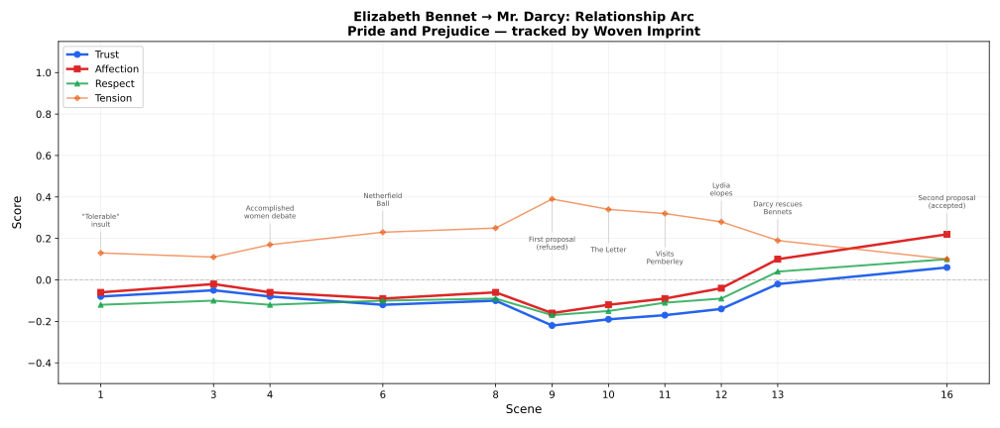

# Woven Imprint

**Persistent Character Infrastructure**

Characters that survive across time.

Woven Imprint is infrastructure for building AI characters that persist. Characters
accumulate memories across sessions, maintain consistent personalities, and develop
relationships that evolve over weeks and months of interaction.

Your NPC remembers the player who helped them three weeks ago. Your companion recalls
a conversation from last summer. Your training partner adapts to the learner's
progress over hundreds of sessions.

Every interaction leaves an imprint. Every memory is woven into who the character becomes.

## The Problem

Most AI characters reset every session. They forget who you are, what you told them,
and what happened between you. The few systems that try to persist memory do it poorly —
stuffing facts into a prompt window until it overflows.

Games, companions, simulations, and interactive fiction all need characters that:
- **Remember** the player weeks later — not just the last 5 minutes
- **Stay consistent** — same personality, same backstory, same voice
- **Develop relationships** — trust builds slowly, betrayal has consequences
- **Grow** — opinions shift, habits form, characters change through experience

No existing tool does all of this. Woven Imprint does.

## Status: Phase 1 (Core Engine)

Architecture informed by 471 academic papers across 6 research domains.
Core memory engine, multi-strategy retrieval, persona model, and relationship tracking implemented.

## Quick Start

```python
from woven_imprint import Engine

engine = Engine("characters.db")

# Create a character with persistent identity
alice = engine.create_character(
    name="Alice",
    birthdate="1998-03-15",  # age derived automatically, increments on birthday
    persona={
        "backstory": "A sharp-witted detective who left the force after her partner's death.",
        "personality": "witty, skeptical, secretly lonely",
        "speaking_style": "clipped sentences, dark humor, avoids emotional topics",
        "occupation": "private investigator",
    },
)

# Conversation — memories persist automatically
response = alice.chat("Hey Alice, how's the case going?")

# End session — generates summary, stores to long-term memory
alice.end_session()

# Days later... she remembers
response = alice.chat("Remember the harbor case we discussed?")

# Character reflects on accumulated experiences
alice.reflect()

# Relationship tracking — trust, affection, respect evolve per interaction
print(alice.relationships.describe("player_1"))

# Export full character state — portable, self-contained
alice.export("alice_v1.json")
```

## Architecture

### Three-Tier Memory
- **Buffer** — raw observations from recent interactions
- **Core** — consolidated memories, session summaries, reflections
- **Bedrock** — fundamental identity, defining moments, core beliefs

### Multi-Strategy Retrieval
Reciprocal Rank Fusion across five rankers: semantic similarity, BM25 keyword match,
recency decay, importance scoring, and relationship context boost.

### Persona Enforcement
Four constraint levels: hard (immutable identity), temporal (age from birthdate,
location changes), soft (personality traits that evolve), emergent (formed through interaction).

### Relationship Model
Five emotional dimensions (trust, affection, respect, familiarity, tension) with
bounded change per interaction, trajectory detection, and key moment tracking.

### Belief Revision
Memories carry certainty scores. Contradictions are tracked, not overwritten —
characters can genuinely change their mind while remembering what they used to believe.

## Use Cases

- **Game NPCs** — characters with real memory across play sessions
- **AI Companions** — persistent personality that remembers and evolves
- **Interactive Fiction** — characters that develop relationships over branching narratives
- **Training Simulations** — consistent role-playing partners that adapt over time
- **Virtual Personalities** — maintained identity across platforms and contexts

## Evaluation: Pride and Prejudice

We tested Woven Imprint by simulating 16 key scenes from Jane Austen's Pride and Prejudice
(public domain, Project Gutenberg). The engine tracked 6 characters across the full story arc
with no scripted outcomes — all relationship changes are LLM-assessed from conversation content.



The arc matches the novel: hostility peaks at the Hunsford proposal (trust -0.22, tension 0.39),
flips after Darcy rescues the Bennets (affection turns positive), and resolves at the second
proposal (trust +0.06, affection +0.22, familiarity 0.99).

**13/13 synthetic benchmarks passing** (93% avg score) — memory recall, cross-session persistence,
belief revision, relationship bounds, persona consistency, character growth.

Full results: [docs/RESULTS.md](docs/RESULTS.md)

## Documentation

- **[Getting Started](docs/GETTING_STARTED.md)** — installation, creating characters, chatting, memory, relationships, LLM backends, integrations
- **[Architecture](docs/ARCHITECTURE.md)** — technical design, schemas, module structure
- **[Evaluation Results](docs/RESULTS.md)** — benchmarks, Pride and Prejudice demo
- **[MCP Setup](examples/mcp_setup.md)** — Claude Desktop, Cursor, Hermes, OpenClaw

## Design Principles

- **Local-first** — SQLite default, runs on consumer hardware, no cloud dependency
- **Model-agnostic** — works with any LLM (Ollama, vLLM, OpenAI, Anthropic)
- **Infrastructure, not app** — provides the persistence layer via clean Python API
- **Characters survive across time** — the core differentiator

## Research Foundations

Woven Imprint's architecture is informed by 471 academic papers across 6 research domains.
Key papers that shaped the design:

- **Park et al. (2023)** — [Generative Agents: Interactive Simulacra of Human Behavior](https://doi.org/10.1145/3586183.3606763)
  Memory stream architecture, retrieval function (recency × importance × relevance), reflection mechanism. The foundation for our three-tier memory model.

- **Chheda et al. (2025)** — [Mem0: Building Production-Ready AI Agents with Scalable Long-Term Memory](https://doi.org/10.3233/faia251160)
  Dual vector + graph memory storage, memory extraction pipeline, conflict resolution. Informed our hybrid retrieval and belief revision system.

- **Cartisien (2026)** — [Engram: A Local-First Persistent Memory Architecture](https://doi.org/10.5281/zenodo.18988892)
  Three-tier memory lifecycle, multi-strategy retrieval via Reciprocal Rank Fusion, belief-revision with certainty scores. Direct influence on our RRF retrieval and local-first SQLite approach.

- **Kwon et al. (2024)** — ["My agent understands me better": Dynamic Human-like Memory Recall and Consolidation](https://doi.org/10.1145/3613905.3650839)
  Human-like memory architecture with sensory/short-term/long-term tiers and autonomous recall.

- **Huang et al. (2025)** — [Post Persona Alignment for Multi-Session Dialogue Generation](https://arxiv.org/abs/2506.11857)
  Response-as-query persona retrieval, two-stage generation with post-hoc alignment. Shaped our consistency checking approach.

- **Song et al. (2020)** — [Generate, Delete and Rewrite: Persona Consistency in Dialogue](https://arxiv.org/abs/2004.07672)
  Three-stage framework for persona-consistent dialogue generation.

- **Welleck et al. (2019)** — [Generating Persona Consistent Dialogues by Exploiting NLI](https://arxiv.org/abs/1911.05889)
  NLI as RL reward for persona consistency. Inspired our NLI-based consistency checker.

- **Li et al. (2025)** — [MoCoRP: Modeling Consistent Relations between Persona and Response](https://arxiv.org/abs/2512.07544)
  Explicit NLI relation extraction between persona and response.

Full research synthesis: [research/synthesis.md](research/synthesis.md)

## License

Apache 2.0 — the core engine is open and easy to adopt.
