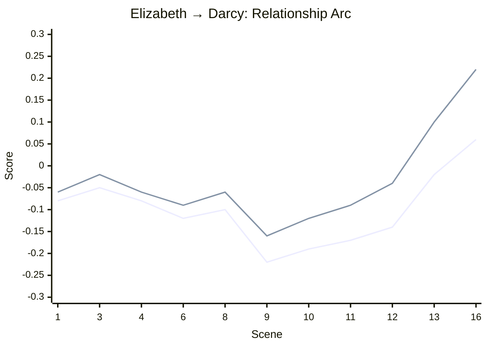

# Woven Imprint — Evaluation Results

## Benchmark Suite

**13/13 passed** | Average score: 93.0% | Duration: 8ms

### Memory & Core Mechanics

| Benchmark | Score | Status |
|-----------|-------|--------|
| recall_precision_at_5 | 1.00 | &#x2705; PASS |
| cross_session_persistence | 0.67 | &#x2705; PASS |
| memory_tier_separation | 0.60 | &#x2705; PASS |
| belief_revision | 0.75 | &#x2705; PASS |
| relationship_bounded_change | 1.00 | &#x2705; PASS |
| familiarity_monotonic | 1.00 | &#x2705; PASS |
| birthday_derived_age | 1.00 | &#x2705; PASS |

### Persona & Consistency

| Benchmark | Score | Status |
|-----------|-------|--------|
| hard_constraint_detection | 1.00 | &#x2705; PASS |
| soft_flag_not_blocking | 1.00 | &#x2705; PASS |
| temporal_age_derivation | 1.00 | &#x2705; PASS |
| growth_threshold_gating | 1.00 | &#x2705; PASS |
| growth_persisted | 1.00 | &#x2705; PASS |
| system_prompt_completeness | 1.00 | &#x2705; PASS |

## Pride and Prejudice — Relationship Evolution

16 scenes from the public domain novel (Project Gutenberg). Characters and interactions extracted from the text.

### Elizabeth Bennet → Mr. Darcy

*From hostility to love — tracked across the novel's key scenes.*

| Scene | Trust | Affection | Respect | Familiarity | Tension |
|-------|-------|-----------|---------|-------------|---------|
| 1. The Meryton Assembly Ball | -0.08 | -0.06 | -0.12 | 0.15 | 0.13 |
| 3. Elizabeth Walks to Netherfield | -0.05 | -0.02 | -0.10 | 0.21 | 0.11 |
| 4. The Accomplished Woman Debate | -0.08 | -0.06 | -0.12 | 0.29 | 0.17 |
| 6. The Netherfield Ball | -0.12 | -0.09 | -0.10 | 0.37 | 0.23 |
| 8. Mr. Collins Proposes — Elizabeth Refuses | -0.10 | -0.06 | -0.09 | 0.41 | 0.25 |
| 9. Darcy's First Proposal at Hunsford | -0.22 | -0.16 | -0.17 | 0.53 | 0.39 |
| 10. Darcy's Letter | -0.19 | -0.12 | -0.15 | 0.65 | 0.34 |
| 11. Elizabeth Visits Pemberley | -0.17 | -0.09 | -0.11 | 0.73 | 0.32 |
| 12. Lydia Elopes with Wickham | -0.14 | -0.04 | -0.09 | 0.81 | 0.28 |
| 13. Darcy Rescues the Bennets | -0.02 | 0.10 | 0.04 | 0.89 | 0.19 |
| 16. Darcy's Second Proposal | 0.06 | 0.22 | 0.10 | 0.99 | 0.10 |

### Mr. Darcy → Elizabeth Bennet

*Respect and affection climb steadily while she still scorns him.*

| Scene | Trust | Affection | Respect | Familiarity | Tension |
|-------|-------|-----------|---------|-------------|---------|
| 1. The Meryton Assembly Ball | -0.03 | -0.02 | -0.01 | 0.08 | 0.05 |
| 3. Elizabeth Walks to Netherfield | -0.01 | 0.01 | 0.03 | 0.14 | 0.03 |
| 4. The Accomplished Woman Debate | 0.01 | 0.04 | 0.07 | 0.20 | 0.01 |
| 6. The Netherfield Ball | -0.02 | 0.02 | 0.08 | 0.28 | 0.13 |
| 8. Mr. Collins Proposes — Elizabeth Refuses | -0.01 | 0.05 | 0.10 | 0.32 | 0.12 |
| 9. Darcy's First Proposal at Hunsford | -0.13 | -0.05 | 0.02 | 0.35 | 0.26 |
| 10. Darcy's Letter | -0.10 | -0.01 | 0.04 | 0.47 | 0.23 |
| 11. Elizabeth Visits Pemberley | -0.07 | 0.03 | 0.06 | 0.55 | 0.21 |
| 12. Lydia Elopes with Wickham | -0.05 | 0.07 | 0.09 | 0.61 | 0.19 |
| 13. Darcy Rescues the Bennets | -0.02 | 0.12 | 0.11 | 0.65 | 0.18 |
| 16. Darcy's Second Proposal | 0.01 | 0.23 | 0.15 | 0.73 | 0.13 |

### Mr. Bingley → Jane Bennet

*Pure warmth. Zero tension. As Austen intended.*

| Scene | Trust | Affection | Respect | Familiarity | Tension |
|-------|-------|-----------|---------|-------------|---------|
| 2. Bingley Dances with Jane | 0.02 | 0.08 | 0.03 | 0.06 | 0.00 |
| 7. Bingley Quits Netherfield | 0.05 | 0.13 | 0.05 | 0.10 | 0.00 |
| 14. Bingley Returns to Netherfield | 0.08 | 0.25 | 0.09 | 0.18 | 0.00 |

### Key Findings

- **Peak hostility** at scene 9 (Darcy's First Proposal at Hunsford): trust=-0.22, tension=0.39
- **Resolution** at scene 16: trust=0.06, affection=0.22
- **Familiarity** climbed from 0.15 to 0.99 — they know each other intimately by the end
- All relationship changes are **LLM-assessed** from conversation content, not scripted
